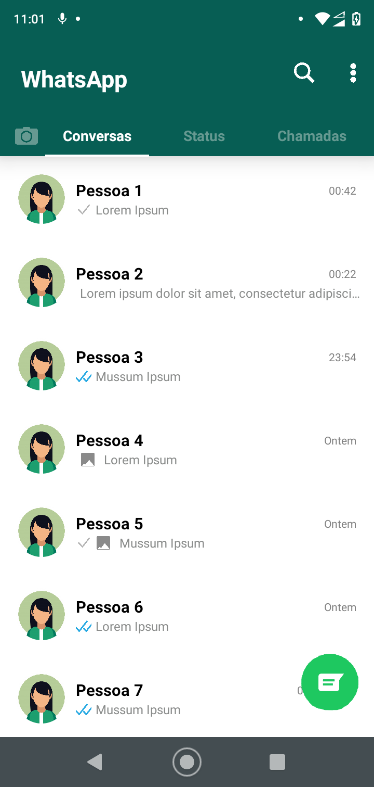
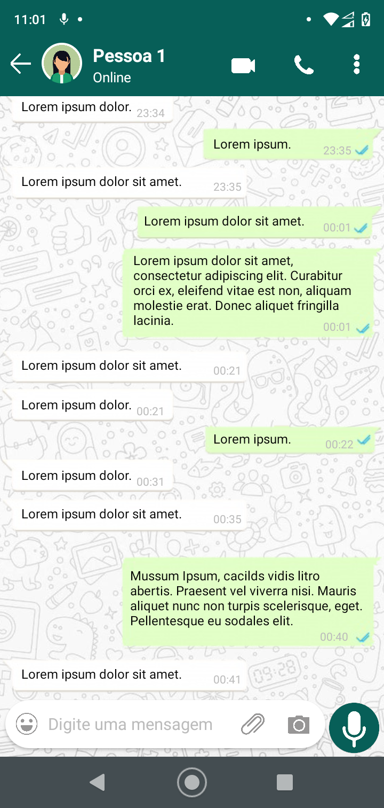

<h1>Clone do WhatsApp</h1>

Este projeto foi criado com o intuito de ser entregue ao professor de React Native Ramon Ives.

O objetivo é fazer a estilização do app o mais parecido possível.

<h2>Algumas informações úteis</h2>
<ol>
  <li>Eu utlizei como base para fazer este clone um moto g7 play (XT1952-2)</li>
  <li>As páginas que eu fiz foram a lista de contatos e o chat (caso queira acessar o chat clique na 'Pessoa 1')</li>
  <li>Aplicação feita no olho</li>
</ol>
<h2>Prints do clone</h2>

